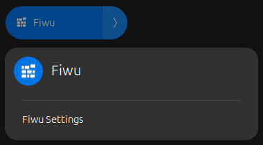
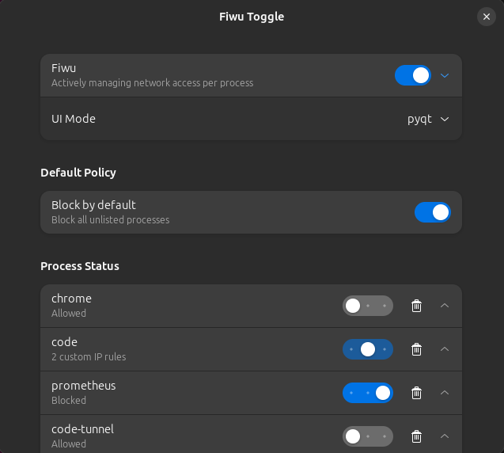

# Fiwu - Interactive Local Firewall

Fiwu is an user-interactive firewall that intercepts packets using an NFQUEUE and maps them to local processes. When a packet is associated with an unknown process within config file, Fiwu prompts the user (via Zenity or tkinter) to allow or block the traffic to that specific process. User decisions are persisted using a simple JSON configuration file, enabling automatic enforcement on subsequent connections.

## Table of Contents

- [Installation](#installation)
  - [Install from the PPA](#install-from-the-ppa)
  - [Install from source](#install-from-source)
- [Service Management](#service-management)
  - [Using GNOME Extension](#using-gnome-extension)
  - [Using Fiwu CLI](#using-fiwu-cli)
- [Technical overview](#technical-overview)
- [Uninstallation](#uninstallation)

## Installation
Fiwu is intended to be installed as a system service. The included `install.sh` detects the distribution and automates environment setup, dependency installation, and GNOME extension installation, building a native `.deb` or `.rpm` package.

### Install from the PPA
On Ubuntu LTS distributions, Fiwu is available via the official PPA:

```
sudo add-apt-repository ppa:rnd-smile/fiwu 
sudo apt update 
sudo apt install fiwu
```

### Install from source
```
git clone [repository]
cd fiwu
sudo ./install.sh
```

`install.sh` picks the right path automatically:
- **Debian/Ubuntu**: builds a `.deb` via `dpkg-buildpackage` and installs it with `apt`.
- **Fedora**: builds an `.rpm` via `rpmbuild` (`fedora/build.sh`) and installs it with `dnf`.


*   **Extension**: Fiwu's GNOME extension requires a re-login to activate.
*   **tkinter**: Support for tkinter mode is limited to Wayland-native desktop sessions.
*   **AppArmor**: The bundled AppArmor profile applies to Debian/Ubuntu installs. Fedora builds skip it, since Fedora relies on SELinux rather than AppArmor by default.


## Service Management
Fiwu could be managed via the GNOME extension or via the CLI wrapper `fiwu`. Gnome extension is only available on Wayland sessions and provides a quick-access desktop interface to monitor and configure Fiwu directly from the system tray.

### Using GNOME Extension
Gnome Extension enables granular control over each process, allowing per-ip mode when combined with tkinter provides a One-Time Action button that does not mutate the persistent config.json and forgets the decision as soon as the application is closed.

Clicking the Fiwu icon in the GNOME status menu opens a drop-down quick menu, clicking Settings inside the drop-down deploys the standalone Fiwu Toggle management panel.



#### Available Features in the UI

- **Interface Selection**: Change the UI Mode layout via a drop-down menu (tkinter or zenity)
- **tkinter mode**: Offers more control over each process enabling per-ip mode and One-Time Action button that does not mutate the persistent config.json and forgets the decision as soon as the application is closed.
- **Zenity mode**: Acts strictly as a permanent prompt without per-ip control.
- **Default Policy**: A master switch allowing you to enable Block by default to automatically drop traffic for all unlisted background processes.
- **Rules Management**: A Clear all rules quick-action button to securely flush all previously saved blocked and allowed processes from the config file.
- **Process Status Lists**: Dedicated sub-sections to visualize and track lists of blocked, custom, allowed Processes, each custom process further expands into showing their associated IPs status. Each process also includes a trash button to remove the process from the config file thereby allowing complete lifecycle management of individual rules.

  

### Using Fiwu CLI
Installing Fiwu registers two entry points: `fiwu`, a CLI wrapper for general control, and `fiwu-daemon`, the background process the systemd unit actually runs:

```bash
fiwu
```

```
usage: fiwu [-h] [-e | -c | -s | -l | -r | -u | -i | -g {zenity,tkinter} | -x]

Fiwu Ctrl

options:
  -h, --help            show this help message and exit
  -e, --start           start service
  -c, --stop            stop service
  -s, --status          service status
  -l, --logs            show logs
  -r, --rules           show rules
  -u, --upgrade         upgrade service
  -i, --reinstall       repair/reinstall (re-run install.sh)
  -g, --gui {zenity,tkinter}
                        set GUI backend and restart service (zenity/tkinter)
  -x, --uninstall       uninstall fiwu
```

## Technical overview

- **Interception**: Fiwu redirects TCP, UDP and ICMP packets to an NFQUEUE (default queue number 1) using iptables rule layering.
- **Identification** (`packet_processor.py`): Packets in the NFQUEUE are correlated with local processes by scanning socket lists using `ss` in a continuous background thread for performance (reported up to ~250 Mbps depending on hardware).
- **Configuration caching & memory** (`state_store.py`): To avoid slowing down the network, Fiwu avoids reading the JSON file for every single packet. It keeps the configuration in memory and only re-reads it from disk when it detects a change via the file's modification time.
- **Thread synchronization**: Fiwu uses dedicated thread-safe locks to prevent race conditions between the asynchronous popup threads, the `ss` port-mapping scans, and the memory cleaning processes.
- **Decision flow** (`dialogs.py`):
  - If a process is unknown, a dialog prompts the user to Allow or Block the traffic.
  - **One-Time Action (tkinter only)**: Includes a session-scoped checkbox to allow temporary authorization or blocking handled purely in memory. A background thread running every 2 seconds uses `psutil` to track running processes and automatically purges the decision as soon as the application closes, without mutating the persistent `config.json`.
  - **Zenity mode**: Acts strictly as a permanent prompt due to native Zenity toolkit layout limitations (no checkbox support).
- **Action**:
  - If blocked (permanently or temporarily), Fiwu immediately terminates active connections for that process using `ss -K` and drops the traffic.
  - Permanent decisions are automatically filtered for duplicates and written to `/etc/fiwu/config.json` for future enforcement.
- **Packaging**: To enable offline builds on Debian-based systems, a vendored copy of NetfilterQueue's source is included under `debian/netfilterqueue` so NetfilterQueue's C extension is built at install time rather than shipped as a prebuilt wheel; this avoids issues with missing `libnetfilter_queue` headers on some distributions.

# Uninstallation

To remove installed components files, systemd unit, AppArmor profiles and local build artifacts:
```
sudo ./uninstall.sh
```

or, if Fiwu is already running, the CLI wraps the same logic:
```
fiwu -x
```

For PPA installs:
```
sudo apt remove fiwu
sudo apt purge fiwu
```